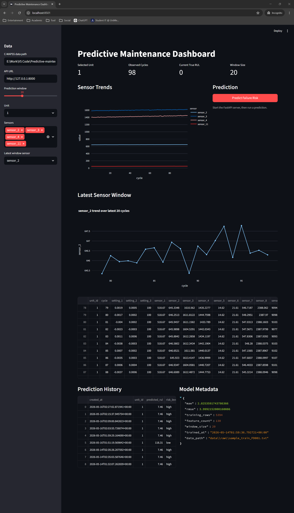
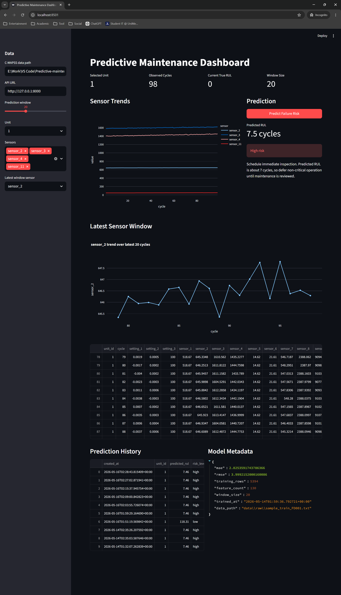
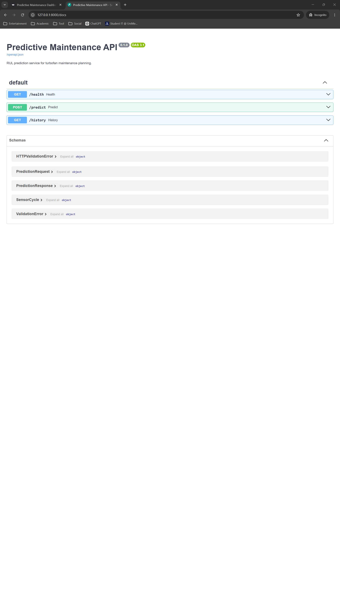

# Predictive Maintenance AI Platform

An industrial AI platform for predicting machine Remaining Useful Life (RUL), classifying operational risk, and recommending maintenance actions from time-series sensor data.

This project is built as a portfolio-ready ML engineering system: a trained model, FastAPI inference service, Streamlit monitoring dashboard, optional direct model inference mode, SQLite prediction history, and reproducible local run workflow.

## Project Overview

The platform simulates how an industrial operations team might monitor rotating equipment, turbofan engines, or other sensor-driven assets. Recent sensor cycles are converted into engineered features, passed through a trained regression model, and translated into a risk level:

- `LOW`
- `MEDIUM`
- `HIGH`
- `CRITICAL`

The dashboard presents system health, machine risk score, predicted RUL, risk badge, maintenance recommendation, sensor trends, model metadata, and recent prediction history.

## Why This Project Matters

Predictive maintenance is a practical AI use case because downtime is expensive, failures can be safety-critical, and sensor data is often available before an asset breaks. A useful system must do more than train a model in a notebook. It needs reliable data flow, a serving interface, operational context, and clear outputs that engineers can act on.

This repository demonstrates:

- ML model training and persistence
- Time-series feature engineering
- FastAPI model serving
- Streamlit monitoring UI
- Risk translation from model output
- Local database persistence
- Beginner-friendly, reproducible setup

## Architecture

```text
Sensor Data / Simulator
        |
        v
Feature Engineering
        |
        v
Trained RUL Model
        |
        v
Prediction Layer
        |
        +-- Local API mode: Streamlit -> FastAPI
        +-- Direct mode: Streamlit -> model artifact
        |
        v
Risk + Recommendation
        |
        v
Streamlit Industrial Monitoring Dashboard
```

Local service flow:

```text
Streamlit Dashboard -> FastAPI API -> ML Model -> Risk + Recommendation -> SQLite History
```

Cloud-friendly direct flow:

```text
Streamlit Dashboard -> Saved ML Model -> Risk + Recommendation
```

Training and inference are intentionally separate. Training happens offline through the scripts in `scripts/`, while the dashboard can either call the FastAPI backend or load the saved model artifact directly.

## Tech Stack

- Python
- pandas and NumPy
- scikit-learn
- FastAPI
- Streamlit
- Plotly
- SQLite
- pytest

## Features

- Predict Remaining Useful Life from recent sensor cycles
- Classify machine risk as `LOW`, `MEDIUM`, `HIGH`, or `CRITICAL`
- Generate simple maintenance recommendations based on predicted risk
- Serve predictions through a FastAPI backend
- Run predictions directly inside Streamlit for cloud deployment
- Monitor machine health in a Streamlit dashboard
- View system health cards, risk score, risk badge, and sensor trends
- Store prediction history in SQLite
- Generate synthetic C-MAPSS-like sample data
- Simulate real-time sensor windows for local demos
- Run locally without cloud services

## Project Structure

```text
.
+-- api/                  # FastAPI backend
+-- app/                  # Streamlit dashboard
+-- data/                 # raw, processed, and runtime data
+-- models/               # trained model artifact and metadata
+-- scripts/              # sample data generation and training CLIs
+-- src/
|   +-- data/             # C-MAPSS loading and RUL target creation
|   +-- database/         # SQLite helpers
|   +-- features/         # feature engineering
|   +-- models/           # training and model loading
|   +-- services/         # prediction, recommendations, simulation
+-- tests/                # pytest tests
```

## Run Locally

Create and activate a virtual environment:

```powershell
py -m venv .venv
.\.venv\Scripts\Activate.ps1
pip install -r requirements.txt
```

Generate sample data:

```powershell
py -m scripts.create_sample_data
```

Train the model:

```powershell
py -m scripts.train_model --data data/raw/sample_train_FD001.txt
```

## Environment Variables

The dashboard supports two prediction modes:

```text
PREDICTION_MODE=api
PREDICTION_MODE=direct
```

Use `api` for local development with FastAPI. Use `direct` for Streamlit Cloud or any deployment where only the Streamlit app is running.

Optional API URL override:

```text
PREDICTIVE_MAINTENANCE_API_URL=http://127.0.0.1:8000
```

PowerShell examples:

```powershell
$env:PREDICTION_MODE="api"
$env:PREDICTIVE_MAINTENANCE_API_URL="http://127.0.0.1:8000"
```

```powershell
$env:PREDICTION_MODE="direct"
```

## Local Development Workflow

Local development uses API mode by default. Streamlit calls FastAPI, FastAPI loads the trained model, and successful predictions are written to SQLite history.

Start the FastAPI service:

```powershell
$env:PREDICTION_MODE="api"
py -m uvicorn api.main:app --reload --port 8000
```

Open the API docs:

```text
http://127.0.0.1:8000/docs
```

In a second terminal, start the dashboard:

```powershell
$env:PREDICTION_MODE="api"
py -m streamlit run app/dashboard.py
```

Open:

```text
http://localhost:8501
```

## Cloud Deployment Workflow

Direct mode is intended for Streamlit Cloud-style deployments where there is no separate FastAPI backend. Streamlit loads `models/rul_model.joblib` directly and uses the same `MaintenancePredictor` service class as the API.

Set the environment variable in your deployment settings:

```text
PREDICTION_MODE=direct
```

Then run only the dashboard:

```powershell
py -m streamlit run app/dashboard.py
```

Direct mode requires the trained model artifact to be present at:

```text
models/rul_model.joblib
```

In direct mode, prediction history is read-only from any existing local SQLite file. New prediction history writes remain part of the FastAPI local workflow.

## API Examples

### Health Check

```powershell
curl http://127.0.0.1:8000/health
```

Example response:

```json
{
  "status": "ok",
  "service": "Predictive Maintenance AI Platform API",
  "model_available": true
}
```

### Prediction

`POST /predict` accepts a machine `unit_id` and recent sensor cycles. Each cycle should include `cycle`, three operating settings, and `sensor_1` through `sensor_21`.

Example response:

```json
{
  "unit_id": 1,
  "predicted_rul": 24.7,
  "risk_level": "HIGH",
  "recommendation": "Schedule immediate inspection. Predicted RUL is about 25 cycles, so defer non-critical operation until maintenance is reviewed."
}
```

### Prediction History

```powershell
curl http://127.0.0.1:8000/history
```

Returns recent prediction records stored in SQLite.

## Screenshots

Add or update screenshots after running the dashboard:

```text
screenshots/dashboard_overview.png
screenshots/prediction_result.png
screenshots/fastapi_docs.png
```

Current screenshot placeholders:







## Testing

Run the test suite:

```powershell
py -m pytest tests
```

Run a lightweight API smoke test:

```powershell
py -c "from fastapi.testclient import TestClient; from api.main import app; c=TestClient(app); print(c.get('/health').json())"
```

## Future Improvements

- Train and evaluate on the full NASA C-MAPSS dataset
- Add machine-level train/validation splits
- Compare Random Forest against gradient boosting and sequence models
- Add model explainability with feature importance or SHAP
- Add Docker and `docker-compose`
- Add CI checks for tests and formatting
- Add model versioning and experiment tracking
- Add drift monitoring and data quality checks
- Add PostgreSQL for multi-user prediction history
- Add a short demo GIF for the README

## CV Bullet Points

- Built an end-to-end predictive maintenance AI platform using Python, FastAPI, Streamlit, scikit-learn, and SQLite.
- Engineered time-series sensor features to predict Remaining Useful Life and classify machine risk into operational severity levels.
- Deployed a local model-serving API with health checks, prediction history, structured request validation, and dashboard integration.
- Designed an industrial monitoring dashboard with system health cards, risk score, sensor trends, and maintenance recommendations.
- Created a reproducible local workflow for sample data generation, model training, API serving, frontend monitoring, and automated tests.

## Current Limitations

This is a portfolio project, not a production maintenance system. The included sample data is synthetic, the model is intentionally simple, and the local SQLite setup is designed for demonstration rather than high-concurrency production use.
