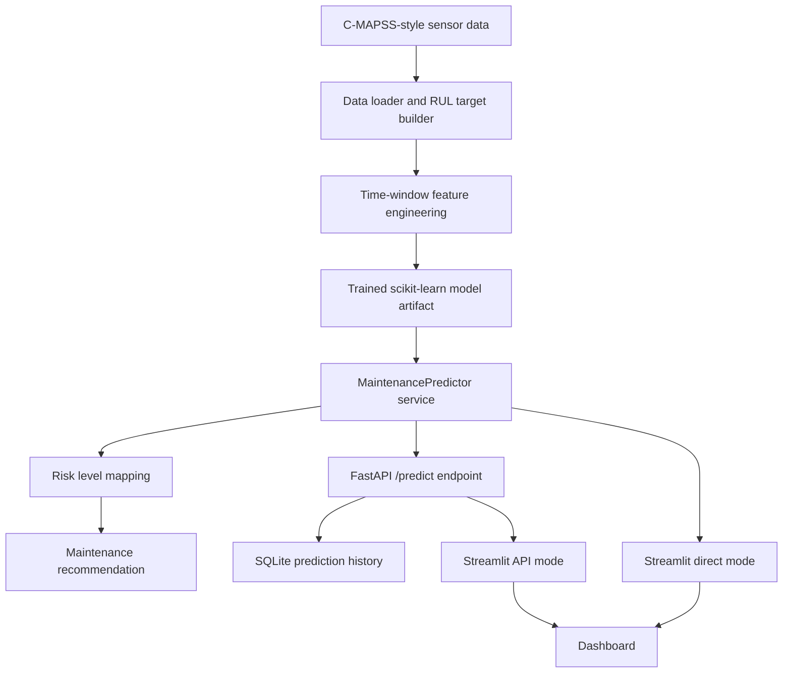

# Architecture

## System Architecture

The project is organized as a small ML platform with separate layers for data loading, feature engineering, model training, prediction serving, dashboard UI, and persistence.

```text
Sensor Data / Simulator
        |
        v
Data Loading + RUL Target Creation
        |
        v
Time-Window Feature Engineering
        |
        v
Random Forest RUL Model
        |
        v
Prediction Service
        |
        +-- Local API Mode: Streamlit -> FastAPI -> Predictor
        |
        +-- Direct Cloud Mode: Streamlit -> Predictor
        |
        v
Risk Level + Maintenance Recommendation
        |
        v
Industrial Monitoring Dashboard
```

## Mermaid Diagram



## Main Components

### Streamlit Dashboard

The dashboard is the user-facing monitoring interface. It shows:

- system health cards
- selected machine metadata
- sensor trend chart
- risk score
- predicted RUL
- risk badge
- maintenance recommendation
- latest sensor window
- prediction history and model metadata

It supports two modes:

- `api`: call the FastAPI backend
- `direct`: load the model directly in Streamlit

### FastAPI Backend

The FastAPI backend exposes:

- `GET /health`
- `POST /predict`
- `GET /history`

It validates input with Pydantic, converts request cycles into a DataFrame, calls the shared predictor service, and stores predictions in SQLite.

### Predictor Service

The predictor service is the central inference boundary. It:

- loads the persisted model artifact
- builds inference features
- aligns columns with training features
- predicts RUL
- clamps negative RUL to zero
- maps RUL to risk level
- generates a maintenance recommendation

### Training Pipeline

Training happens outside the web app. The training script:

- loads C-MAPSS-style data
- adds RUL target values
- builds rolling-window features
- trains a Random Forest model inside a scikit-learn pipeline
- saves the model artifact with `joblib`
- writes metadata such as MAE, RMSE, training rows, feature count, and training timestamp

## Data Flow

### Training Flow

```text
sample_train_FD001.txt
  -> load_cmapss()
  -> add_rul_target()
  -> build_training_frame()
  -> RandomForestRegressor pipeline
  -> models/rul_model.joblib
  -> models/model_metadata.json
```

### Local API Prediction Flow

```text
Streamlit dashboard
  -> POST /predict
  -> Pydantic validation
  -> MaintenancePredictor.predict()
  -> feature engineering
  -> model prediction
  -> risk + recommendation
  -> SQLite history
  -> dashboard response
```

### Deployed Streamlit Flow

```text
Streamlit dashboard
  -> direct MaintenancePredictor.predict()
  -> feature engineering
  -> model prediction
  -> risk + recommendation
  -> dashboard response
```

## Local vs Deployed Workflow

Local development uses API mode by default:

```powershell
$env:PREDICTION_MODE="api"
py -m uvicorn api.main:app --reload --port 8000
py -m streamlit run app/dashboard.py
```

Deployment uses direct mode:

```toml
PREDICTION_MODE = "direct"
```

This decision was made because Streamlit Community Cloud hosts the Streamlit app but does not automatically host a separate FastAPI backend. Direct mode preserves the deployed demo while still keeping the FastAPI architecture available locally.

## What I Should Understand For Interviews

I should be able to explain why the architecture has both modes:

> I wanted to show a realistic local API architecture with FastAPI, but also deploy the project for free on Streamlit Cloud. Rather than duplicating prediction logic, I put inference in a shared service class. FastAPI and Streamlit both call that same class. The deployment mode only changes the routing, not the model logic.

## How I Would Improve This In Production

- Deploy FastAPI as a separate service on Render, Fly.io, AWS, Azure, or GCP.
- Put Streamlit behind authentication if exposing operational data.
- Use a production database instead of local SQLite.
- Store model artifacts in object storage or a model registry.
- Add request logging, latency metrics, and model monitoring.
- Add asynchronous or batch prediction support for fleet-level inference.
